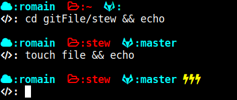

# Cloud Theme

It's an adaptation of this theme:

 [github.com/robbyrussell/oh-my-zsh/blob/master/themes/cloud.zsh-theme](github.com/robbyrussell/oh-my-zsh/blob/master/themes/cloud.zsh-theme) 
 
 It becomes like that:
 
 
